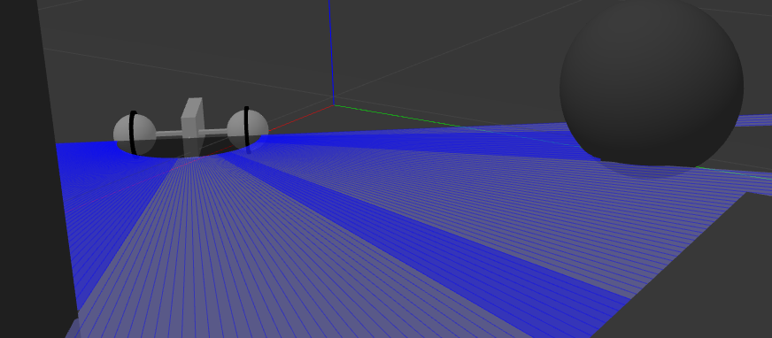
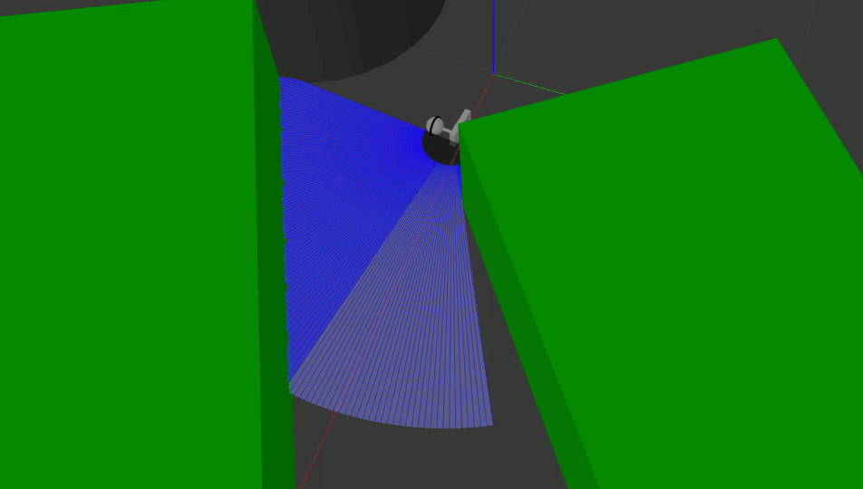

*From self-driving cars to medical surgeons, robots have become ubiquitous. Ensuring they operate safely and correctly is evermore important. The most popular middleware for robotics is the open-sourced Robot OS. We are work on developing an Imandra/OCaml interface to Robot OS, opening up the world of robotics to the latest advancements in automated reasoning.* 

In this repository you can find the OCaml bindings to the ROS messaging layer, a collection of ROS node models and examples of formal verification of properites of these models.    

# Running the code 

To run the code you'll need:
 - an OCaml compiler installed, the current code was tested with the compiler version `4.03.0`
 - the `opam` OCaml package manager
 - ROS "melodic" distribution with rospy python client API and Gazebo simulator  

As usual with the ROS projects, we'll need to run several processes in their individual terminals. 

In the first terminal, we enter the OCaml code folder, install the necessary opam packages and run our ROS node:

    cd imandra_model
    make dev-setup
    make run-node

In the second terminal we build the catkin workspace and run the Gazebo simulator with our bot model loaded:
by
    cd imandrabot_ws
    catkin_make
    source devel/setup.bash
    roslaunch imandrabot_gazebo imandrabot_world.launch

Finally, in the last terminal we run the python script that serves a as "buffer" between the two processes above:

    cd imandrabot_ws
    python src/zmq_wrapper/src/ros_zmq_translate.py

# Formal verification
ROS adopts a distributed architecture for robotic computing, enabling independent nodes to communicate via messages across the ROS computation graph. While having many practical advantages, such distributed systems are inherently much more complex and difficult to reason about. To ensure that the software controlling such a distributed system is correct we need to turn to formal verification — mathematically reasoning about the correctness of computer programs.

 [Imandra](https://www.imandra.ai) is a proof assistant that is able to reason about your code written in a subset of OCaml. Imandra provides its own Jupyter kernel that allows one to interactively develop, document and share Imandra models via computational notebook interfaces. If you want to give Imandra a try, visit [https://try.imandra.ai/](https://try.imandra.ai/) to explore our collection of introductory notebooks and run your own Imandra kernel instance in the cloud. Extensive documentation is available at [https://docs.imandra.ai/](https://docs.imandra.ai/). If you wish to install Imandra locally or within your own infrastructure, see these [installation instructions](https://docs.imandra.ai/imandra-docs/notebooks/installation/).

 Here we provide [an example notebook](https://github.com/AestheticIntegration/imandra-ros/blob/e142c40e1533caf6354820898c6a46aa13b348f0/docs/notebooks/Creating%20and%20verifying%20a%20ROS%20node%20in%C2%A0Imandra.ipynb) that walks through the creation and formal verification of the ROS node model that we've compiled and executed in the previous section.
